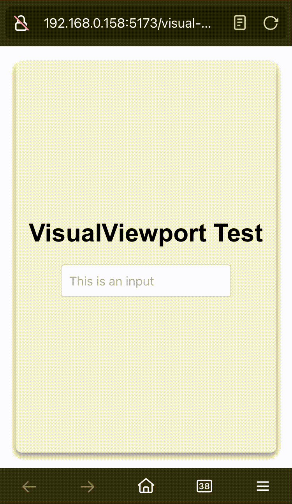
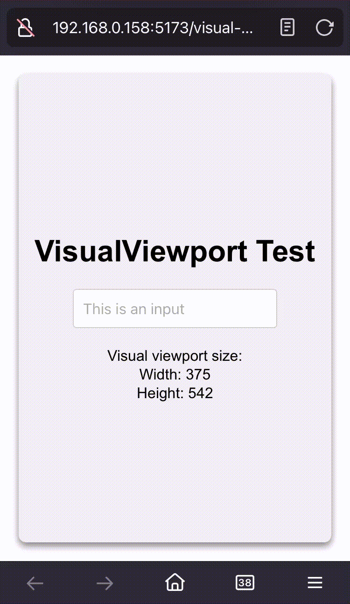

# Visual Viewport Test

Testing [visualViewport](https://developer.mozilla.org/en-US/docs/Web/API/VisualViewport) API for iOS virtual keyboard resizing.

This monorepo contains two projects built with Vite and TypeScript:

## The Problem

When the virtual keyboard is opened on iOS, the whole page is pushed up and some part of the page is hidden. This behavior sometimes are not desired, especially when the page is a single-page application.

<p align="center">
  
</p>

## The Solution

The `visualViewport` API provides information about the visual viewport of a window. It can be used to detect the virtual keyboard resizing and adjust the layout accordingly.

<p align="center">
  
</p>

## Live Demo

- [Vanilla JS](https://seanjiangsh.github.io/visual-viewport-test/vanilla)
- [React](https://seanjiangsh.github.io/visual-viewport-test/react)

## Projects

### 1. Vanilla SPA

- **Location:** `packages/vanilla-spa`
- **Description:** A simple single-page application built with vanilla JavaScript and TypeScript.
- **Entry Point:** `src/main.ts`
- **HTML Structure:** `src/index.html`
- **Configuration:**
  - `package.json`: Lists dependencies and scripts.
  - `tsconfig.json`: TypeScript configuration.
  - `vite.config.ts`: Vite configuration.

### 2. React SPA

- **Location:** `packages/react-spa`
- **Description:** A single-page application built with React and TypeScript.
- **Entry Point:** `src/main.tsx`
- **Main Component:** `src/App.tsx`
- **HTML Structure:** `src/index.html`
- **Configuration:**
  - `package.json`: Lists dependencies and scripts.
  - `tsconfig.json`: TypeScript configuration.
  - `vite.config.ts`: Vite configuration.

## Setup Instructions

0. **Make sure you have pnpm installed globally**
   You can install pnpm globally by running the following command:

   ```
    npm install -g pnpm
   ```

1. **Install Dependencies:**
   Run the following command in the root of the monorepo:

   ```
   pnpm install
   ```

2. **Run Projects:**

   - For the Vanilla SPA:
     ```
     cd packages/vanilla-spa
     pnpm dev
     ```
   - For the React SPA:
     ```
     cd packages/react-spa
     pnpm dev
     ```
   - Run all projects:

     ```
     # In the root of the monorepo
     npm run dev
     ```

   - Build all projects:

     ```
     # In the root of the monorepo
     npm run build
     ```
